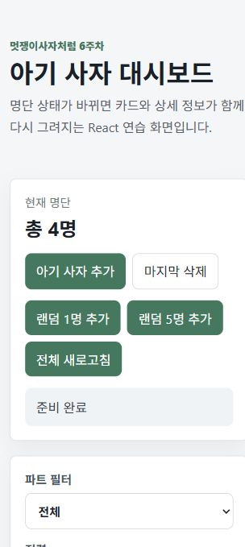

# 📘 Today I Learned

### 1. 오늘 배운 내용
- `useState`로 명단, 폼 입력값, 필터, 정렬, 검색어, API 요청 상태를 관리했다.
- `useEffect`로 ESC 키 이벤트 리스너를 등록하고 컴포넌트 상태에 맞게 정리하는 방법을 연습했다.
- DOM을 직접 조작하지 않고, 상태 배열을 변경하면 React가 화면을 다시 렌더링한다는 흐름을 배웠다.
- `fetch`를 사용해서 외부 API 데이터를 불러오고, 화면에서 사용할 데이터 형태로 변환했다.
- 반복되는 상태 관리 로직을 `Custom Hook`으로 분리하면 `App.jsx`가 훨씬 읽기 쉬워진다는 것을 알게 되었다.

### 2. 핵심 정리 (내 언어로)
- React에서는 화면을 직접 고치는 것이 아니라, 화면의 기준이 되는 데이터를 바꾼다.
- 아기 사자 명단은 배열 상태로 관리하고, 추가/삭제/새로고침이 일어나면 배열을 새로 만들어 상태에 넣는다.
- 필터, 정렬, 검색어도 상태이기 때문에 값이 바뀌는 순간 현재 조건에 맞는 카드만 다시 보인다.
- `useEffect`는 렌더링 자체가 아니라, API 요청이나 이벤트 리스너처럼 화면 밖에서 일어나는 일을 처리할 때 사용한다.
- `useLions`라는 Custom Hook에 명단 로직을 모아두니 컴포넌트는 props를 받아 화면을 그리는 역할에 집중할 수 있었다.

### 3. 결과 이미지(스크린샷)


### 4. 느낀 점
- 4주차에는 DOM을 직접 찾아서 붙이고 지우는 방식이라 코드가 길어졌는데, React에서는 상태만 바꾸면 화면이 같이 바뀌어서 흐름이 더 명확했다.
- 처음에는 `useState`가 단순히 값을 저장하는 기능처럼 느껴졌지만, 실제로는 화면을 다시 그리게 만드는 중요한 기준이라는 것을 이해했다.
- API 요청 중 로딩, 성공, 실패, 재시도 상태를 따로 관리해보니 사용자에게 현재 상황을 보여주는 것이 중요하다는 생각이 들었다.
- 앞으로는 기능을 만들 때 먼저 "어떤 상태가 필요하지?"를 생각하면서 코드를 짜야겠다고 느꼈다.

## 실행 방법

```bash
yarn install
yarn dev
```

개발 서버가 켜지면 `http://localhost:5173`에서 확인할 수 있다.
