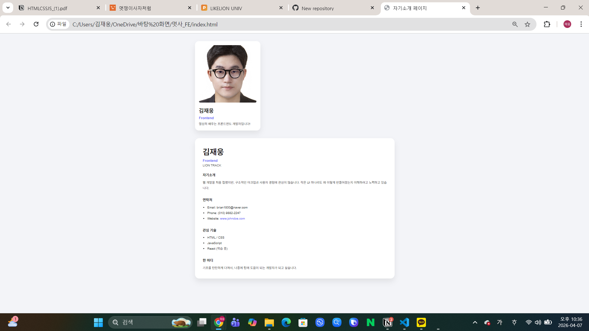

# 📘 Today I Learned

### 1. 오늘 배운 내용
- HTML과 CSS의 역할을 분리해 정적 자기소개 페이지를 구현했다.
- `index.html`에서는 웹페이지의 구조와 콘텐츠를 작성하고, `style.css`에서는 색상, 여백, 글자 크기, 카드 디자인 등 화면 스타일을 담당하도록 분리했다.
- 자기소개 요약 카드와 상세 소개 영역을 하나의 페이지 안에서 위아래로 배치했다.
- 카드 내부 요소 정렬에는 Flexbox를 사용했고, margin, padding, border의 차이를 직접 적용하며 레이아웃을 구성했다.
- 의미에 맞는 HTML 태그를 사용해 구조를 작성하는 연습을 했다.

### 2. 핵심 정리 (내 언어로)
HTML은 웹페이지의 뼈대와 내용, CSS는 디자인과 배치를 담당한다. 둘을 분리하면 나중에 내용을 수정할 때는 HTML만 보고 고치면 되고, 디자인을 바꿀 때는 CSS만 수정하면 되기 때문에 관리가 훨씬 편하다.또 HTML 태그는 단순히 화면에 어떻게 보이는지만 생각하는 것이 아니라, 이 콘텐츠가 제목인지, 문단인지, 목록인지처럼 의미에 맞게 선택해야 한다. 그래야 구조를 이해하기 쉽고 유지보수도 편해진다.

이번 과제를 하면서 Flexbox의 장점도 느꼈다. 예전처럼 위치를 하나씩 억지로 맞추는 게 아니라, 요소들을 묶어서 정렬 방향과 간격을 한 번에 제어할 수 있어서 카드 UI를 만들 때 훨씬 수월했다.그리고 화면에서 보이는 요소 하나도 실제로는 content, padding, border, margin이 합쳐져서 만들어진다는 점을 확인했다. 여백이 어색할 때 단순히 크기가 이상하다고 생각하는 것이 아니라, 바깥 여백인지 안쪽 여백인지 구분해서 수정해야 한다는 걸 배웠다.

### 3. 결과 이미지(스크린샷)
- 자기소개 요약 카드와 상세 소개 영역이 한 페이지 안에 모두 보이도록 구현했다.
- 전체 화면이 보이도록 캡처했고, 작업 날짜와 시간이 보이도록 함께 첨부했다.

### 4. 느낀 점
이번 과제를 하면서 HTML과 CSS를 왜 분리해서 작성하는지 조금 더 명확하게 이해할 수 있었다. 처음에는 단순히 파일을 나누는 것처럼 보였는데, 실제로 해보니 구조와 디자인이 분리되어 있어서 수정할 때 훨씬 덜 헷갈렸다.또 눈으로 보기에는 단순한 자기소개 페이지여도, 태그를 어떤 의미로 선택할지, 여백을 어떻게 줄지, 카드 내부 요소를 어떻게 정렬할지를 하나씩 고민해야 한다는 점이 인상적이었다. 특히 Flexbox를 사용하니까 요소 정렬이 훨씬 편해져서 앞으로도 자주 활용할 수 있을 것 같다.
이번 과제를 통해 단순히 보이게 만드는 것이 아니라, 구조적으로 읽히는 페이지를 만드는 것이 중요하다는 점을 배웠다.